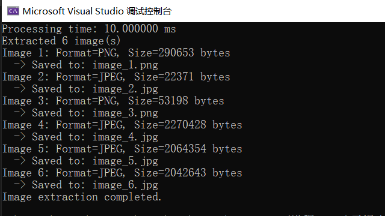
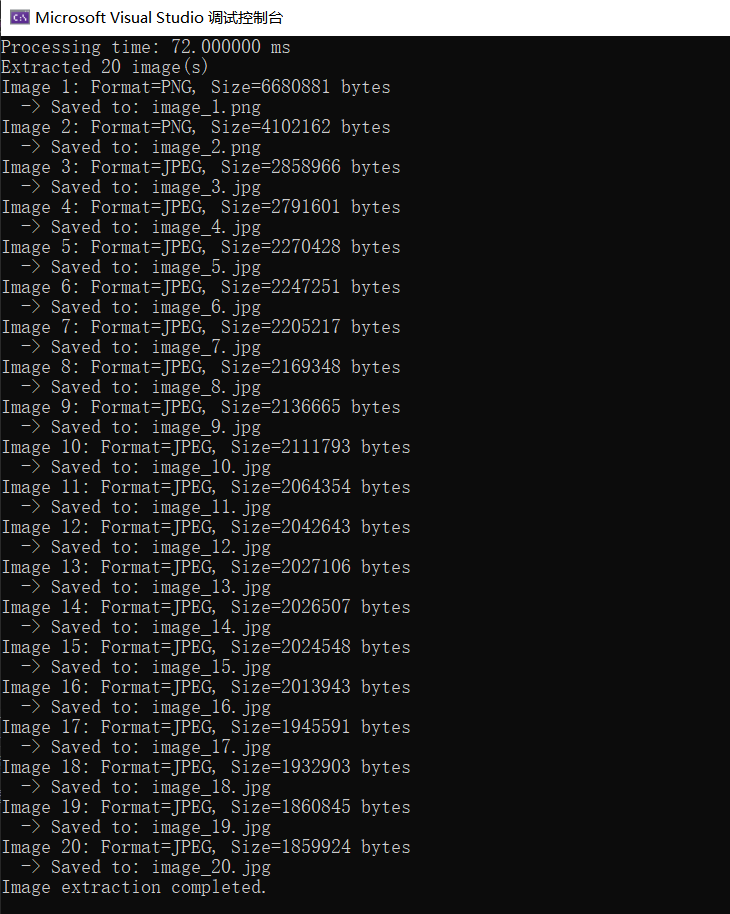

# xls2img
[Chinese](./README_CN.md) | [English](./README.md)

`xls2img` is a C library designed to extract embedded images (such as JPEG, PNG) from Microsoft Excel 97-2003 format `.xls` files.

## Implementation

### Extraction Approach

1. **Obtain the WorkBook Stream**
   *   According to Microsoft's related documentation, files like JPG and PNG are stored within the WorkBook stream. Therefore, the first step is to parse the XLS file format. Understanding the XLS format is extremely difficult. Thanks to the [compoundfilereader](https://github.com/microsoft/compoundfilereader) repository from Microsoft, which greatly simplifies this process, allowing us to parse the WorkBook stream from XLS files.

2. **Find `MsoDrawingGroup` within the WorkBook Stream**
   *   The WorkBook stream consists of multiple BIFF8 structures. Each BIFF8 contains a record type, record size, and record data. The required image data corresponds to the record type `MsoDrawingGroup`. This structure stores the embedded image data within the XLS file. By iterating through each BIFF8 structure, we can obtain all `MsoDrawingGroup` data.
   *   Due to the storage size limit of a single BIFF8, an image's data might be split across multiple BIFF8 records. Fortunately, whenever image data is split, subsequent data blocks (apart from the first) are marked with `recordType = BIFF8_CONTINUE`. This allows us to reassemble these separated data blocks.

3.  **Parsing Image Data from `MsoDrawingGroup`**
    *   The `MsoDrawingGroup` record contains not only the raw image data but also interleaved metadata for purposes like describing graphic layouts and positions. Therefore, its entire data block cannot be written directly to a file. Further parsing is required to extract the pure image data. Although Microsoft provides relevant official documentation, it is voluminous, and parsing image data directly according to the full specifications is complex and time-consuming.
    *   Analysis of the `MsoDrawingGroup`'s binary data reveals that most of its content is the raw image data, and these images are stored sequentially and completely. Based on this observation, employing a **Sequential Stream Splitting Algorithm based on File Signatures** proves to be an efficient and viable solution.

4.  **Sequential Stream Splitting Algorithm based on File Signatures**
    *   `xls2img` specifically targets PNG and JPEG image formats. Its core implementation approach is as follows:
        1.  **PNG:** Iterate through the `MsoDrawingGroup` data stream to precisely match the distinctive 8-byte PNG file header signature (`89 50 4E 47 0D 0A 1A 0A`). This signature has high specificity and a very low probability of misidentification. After locating the header, strictly follow the PNG format specification to find its corresponding `IEND` chunk, thereby determining the complete boundary of the image data.
        2.  **JPEG:** Similarly, iterate through the data stream to find the starting markers for JPEG files. Common markers include headers for `JFIF` (Application Segment APP0) and `Exif` (Application Segment APP1), which also possess good distinctiveness. For the end marker, the standard ending for a JPEG file is `0xFF 0xD9`. However, the byte sequence `0xFF 0xD9` can sometimes also appear within the actual pixel data (content) of the image. Using a sequential forward scan to find the end marker is highly susceptible to capturing these "false" end markers, potentially splitting one complete image into multiple segments incorrectly. To circumvent this issue, this library employs a **backward traversal strategy** to locate `0xFF 0xD9`. The specific trigger is: once the next valid image file header is successfully located, the search begins backward from the position of this new header to find the true end marker of the previous image.
    *   Through these methods, precise extraction of images in these two mainstream formats is achieved. For performance metrics, please refer to the tests below.

## CLI Tool

In addition to being used as a library, 'xls2img' also provides a handy command-line tool for extracting images directly.

** Download :** Go to the project's [Releases](https://github.com/capp-adocia/xls2img/releases) page and download the archive called 'xls2img_tool.zip'.

## Performance and Accuracy

**Performance Tests** (Parsing the Workbook stream and extracting all images from XLS in Release mode):

| File Size | Number of Images | Actual Extracted | Status | Details |
| :--- | :--- | :--- | :--- | :--- |
| 6.5 MB | 6 | 6 | ✅ | Extracted images are identical to the source images<br> |
| 47.5 MB | 20 | 20 | ✅ | Extracted images are identical to the source images<br> |

**Summary:** After multiple rounds of testing, performance is acceptable, and no specific cases where correct extraction fails have been found.

## Installation

### Building from Source

1.  **Clone the repository:**
    ```bash
    git clone https://github.com/capp-adocia/xls2img.git
    cd xls2img
    ```

2.  **Build:**
    *   **Windows (MSVC):**
        ```bash
        cmake -B build
        cmake --build build --config Release
        ```
        Generated files are located in the `build/` directory.
    *   **Linux (Not supported yet)**

3.  **Install:**
    *   The build process generates `.lib` and `.dll` files. You can copy these library files along with the `xls2img.h` header file to your project or system's library directory.

## Quick Start

Here is a simple C language example demonstrating how to use the `xls2img` library. This example is sourced from `examples/main.c`.

```c
int main()
{
    // Use default test file
    const wchar_t* filepath = L"./test.xls";

    // Read file
    unsigned char* file_buffer = NULL;
    size_t file_size = 0;

    if (!read_file(filepath, &file_buffer, &file_size))
    {
        return -1;
    }

    // Initialize xls2img reader
    XLS2IMG_READER* reader = NULL;
    int ret = xls2img_open(&reader, file_buffer, file_size);
    if (ret != XLS2IMG_SUCCESS)
    {
        fprintf(stderr, "Initialization failed: %s\n", xls2img_strerror(ret));
        free(file_buffer);
        return -1;
    }

    // Extract workbook stream
    void* workbook_data = NULL;
    size_t workbook_size = 0;

    ret = xls2img_get_workbook(reader, &workbook_data, &workbook_size);
    if (ret != XLS2IMG_SUCCESS)
    {
        fprintf(stderr, "Failed to extract workbook: %s\n", xls2img_strerror(ret));
        xls2img_close(reader);
        free(file_buffer);
        return -1;
    }

    // Extract images
    XLS2IMG_RESULT images = { NULL, 0 };
    ret = xls2img_extract_images(workbook_data, workbook_size, &images);

    // Process results
    if (ret > 0)
    {
        printf("Extracted %d images\n", images.count);

        // Process each image
        for (int i = 0; i < images.count; i++)
        {
            const XLS2IMG_IMAGE* img = &images.images[i];
            const char* format_str = (img->format == XLS2IMG_PNG) ? "PNG" : "JPEG";

            printf("Image %d: Format=%s, Size=%zu bytes\n", i + 1, format_str, img->size);
        }
    }
    else
        fprintf(stderr, "Failed to extract images: %s\n", xls2img_strerror(ret));

    // Cleanup
    free(file_buffer);
    xls2img_free_result(&images);
    xls2img_free_workbook_data(workbook_data);
    xls2img_close(reader);

    printf("Image extraction completed.\n");
    return 0;
}
```

## API Documentation

Detailed API documentation can be found in the `xls2img.h` header file, which includes detailed explanations for each function, enumeration, and structure.

## Other

### Build System

This project uses [CMake](https://cmake.org/) as the build system. Please ensure CMake is installed on your system.

### Dependencies

*   **C Standard Library:** The project depends on the standard C library.

### Architecture Overview

*   `xls2img.h`: Public API interface definition.
*   `xls2img_reader.c`: Core implementation of XLS file parsing and reading logic.
*   `xls2img_images.c`: Core implementation of image extraction and processing logic.

## License

This project is licensed under the [MIT License](./LICENSE). See the `LICENSE` file for details.

## Acknowledgements


*   Once again, thanks to [microsoft](https://github.com/microsoft/compoundfilereader)'s `compoundfilereader` project and its related tools and documentation for providing reference for understanding the XLS file format.

